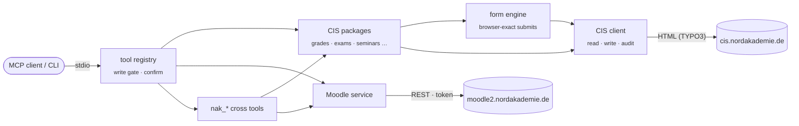

<p align="center">
  <a href="https://github.com/Raindancer118/nak-api/releases"></a>
  <a href="https://github.com/Raindancer118/nak-api/actions"></a>
  
  
  <a href="LICENSE"></a>
</p>

<p align="center">
  <b>Ask what's due this week. Get CIS and Moodle in one answer.</b><br>
  Grades with the full Notenspiegel, exams with their real deadlines, your timetable, seminars, electives,<br>
  Transferleistungen and every Moodle course — for any MCP client and on the command line.
</p>

<p align="center">
  <a href="#overview">Overview</a> &nbsp;·&nbsp;
  <a href="#studies">CIS</a> &nbsp;·&nbsp;
  <a href="#moodle">Moodle</a> &nbsp;·&nbsp;
  <a href="#safety">Safety</a> &nbsp;·&nbsp;
  <a href="#get-it">Install</a> &nbsp;·&nbsp;
  <a href="#under-the-hood">How it works</a>
</p>

<br>


<p align="center"><sub>All names, modules and dates in the pictures are made up.</sub></p>

<br>

<a id="overview"></a>


<table>
<tr>
<td width="50%" valign="top">

**`nak_dashboard`** · today and tomorrow at a glance: lectures, urgent deadlines from both systems, the exams you're registered for, unread Moodle messages, the current quarter and your copy balance.

**`nak_deadlines`** · one chronological list: Moodle submissions and tests, exam dates, the last day to sign up for an exam you're *not* registered for, the last day to withdraw from one you are, Transferleistung due dates and graduation deadlines. Anything under 72 hours is flagged.

</td>
<td width="50%" valign="top">

**`nak_agenda`** · a calendar for any range: lectures from your Zenturie plan (only *your* electives), Moodle due dates and your exams, grouped by day.

**`nak_module I151`** · one module across both systems: grade, attempt and status, the exam and whether you're registered, its place in the study plan, the next sessions, the grade distribution, and the matching Moodle course with its open assignments.

</td>
</tr>
</table>

> [!TIP]
> If one system is down, the others still answer. Results then carry an `unavailable_sources` field instead of failing as a whole.

<br>

<a id="studies"></a>


The CIS has no API. nak reads its TYPO3 pages the way a browser does and turns them into clean data.

<table>
<tr>
<td width="33%" valign="top">

**Grades**
- every module with grade, attempt (`5,0 (2.Versuch)`), status and credits
- seminars, Transferleistungen, average, credits total
- **Notenspiegel** of any exam with fail rate and *your* rank
- attendance per session
- transcript as PDF

</td>
<td width="33%" valign="top">

**Planning**
- study plan: modules × semesters, exam forms, credits
- **progress**: credits earned of 210, what's missing for the Bachelorthesis
- timetable as real events, filtered to your electives
- lecture periods, graduation deadlines

</td>
<td width="33%" valign="top">

**Doing things** ⚠
- register / withdraw from exams, with the PVO deadlines computed
- seminars per quarter, details, seats taken, sign-up and waitlist
- electives: browse, details, choose a Termin
- apply for a Transferleistung (PDF upload)
- profile: contact, address, sharing settings

</td>
</tr>
</table>

<details>
<summary><b>All CIS tools</b></summary>

| Tool | What it does |
| --- | --- |
| `cis_status` · `cis_login` · `cis_logout` | who you are; session handling (renews itself) |
| `cis_profile` · `cis_contact` · `cis_address` | personal data, e-mail/phones, main or term address |
| `cis_sharing` · `cis_payment` · `cis_balance` | grade/registration sharing with your company and classmates, SEPA status (masked), copy balance |
| `cis_classmates` | a Zenturie: names and companies only |
| `cis_grades` · `cis_grade_distribution` · `cis_attendance` · `cis_transcript` | Leistungsübersicht, Notenspiegel + rank, attendance, PDF |
| `cis_studienplan` · `cis_progress` | study plan, credits and thesis prerequisites |
| `cis_timetable` · `cis_list_stundenplan` · `cis_download_stundenplan` | events from the Zenturie calendar, raw .ics/.html files |
| `cis_vorlesungszeiten` · `cis_abschlussfristen` | quarters, graduation deadlines |
| `cis_list_klausuren` · `cis_klausur_action` ⚠ | exam overview with deadlines; register / withdraw |
| `cis_list_seminars` · `cis_seminar_detail` · `cis_seminar_participation` · `cis_seminar_action` ⚠ | seminar programme, details, seats, sign-up / waitlist |
| `cis_list_wahlpflicht` · `cis_wahlpflicht_detail` · `cis_select_wahlpflicht` ⚠ | electives |
| `cis_list_transfer` · `cis_transfer_bewertung` · `cis_download_transfer_document` · `cis_transfer_options` · `cis_transfer_register` ⚠ | Transferleistungen with weighted overall mark |
| `cis_update_contact` ⚠ · `cis_update_address` ⚠ · `cis_set_sharing` ⚠ · `cis_vertiefung` · `cis_set_vertiefung` ⚠ | profile changes |
| `cis_list_certs` · `cis_download_cert` | enrolment certificates (de/en) |
| `cis_page` · `cis_download` | any CIS information page as text plus its downloads |

</details>

<br>

<a id="moodle"></a>


<table>
<tr>
<td width="50%" valign="top">

- **Courses and contents** with every file, and **find** across all courses ("foliensatz 9", "klausur pdf")
- **Read files directly**: PDFs page by page, HTML pages, text
- **Assignments** with intro, attachments, your submission status, grade and feedback
- **What's new** since last week in your running courses

</td>
<td width="50%" valign="top">

- **Quizzes** with time windows, your attempts and best grade; **reviews** of finished attempts to learn from
- **Forums and messages**, grades per course, completion, choices and group choices
- **Submit** files or online text ⚠, reply and post ⚠, message ⚠, vote ⚠
- `moodle_call` for any other web service function (writes only with `confirm=true`)

</td>
</tr>
</table>

<br>

<a id="safety"></a>


Exam registrations, seminar sign-ups and elective choices are binding. nak treats them that way.

<table>
<tr>
<td width="50%" valign="top">

**Preview first, always.** Every tool marked ⚠ answers *without* `confirm=true` with a preview of exactly what would be sent — and sends nothing. The gate sits in the tool registry, not in each tool, and a test calls every write tool without confirmation and proves that no request leaves.

**Read-only switch.** `NAK_READONLY=1` blocks every write in both HTTP clients before any network I/O.

</td>
<td width="50%" valign="top">

**A trail of everything.** Each write is appended to `~/.config/cis-api/writes.log`: target and field names, never values.

**Typed confirmation on the CLI.** `confirm=true` additionally needs `JA` typed into an interactive terminal.

**Other people's data stays theirs.** Classmates come back as name and company only; seminar lists as head counts.

</td>
</tr>
</table>

<br>

<a id="get-it"></a>


Download a binary from the [latest release](https://github.com/Raindancer118/nak-api/releases/latest) (Linux, macOS, Windows), or build it:

```sh
git clone https://github.com/Raindancer118/nak-api && cd nak-api && go build -o nak .
CIS_USER=12345 CIS_PASS='…' ./nak tool nak_dashboard
```

Add it to your MCP client:

```json
{
  "mcpServers": {
    "nak": { "command": "/path/to/nak", "args": ["mcp"], "env": { "CIS_USER": "…", "CIS_PASS": "…" } }
  }
}
```

> [!TIP]
> Keep the password out of config files: start nak through a secret launcher (vault, `pass`, systemd credentials …) that injects `CIS_USER`/`CIS_PASS` into the environment.

<details>
<summary><b>Configuration</b></summary>

| Variable | Default | Meaning |
| --- | --- | --- |
| `CIS_USER`, `CIS_PASS` | – | NAK login (also used for Moodle) |
| `MOODLE_USER`, `MOODLE_PASS` | CIS login | separate Moodle credentials |
| `NAK_READONLY` | off | `1` blocks all writes |
| `NAK_DOWNLOAD_DIR` | `~/Downloads/nak` | default download folder; files are never overwritten |
| `NAK_TZ` | `Europe/Berlin` | time zone of all dates |
| `MOODLE_URL`, `CIS_BASE_URL` | moodle2 / cis.nordakademie.de | other hosts (tests) |

The CIS session lives in `~/.config/cis-api/session.json` (0600) and is renewed automatically when it expires. PDF text uses Poppler's `pdftotext` when installed, a built-in extractor otherwise.

</details>

<details>
<summary><b>Command line</b></summary>

```
nak mcp                          MCP server on stdio
nak tools [filter] [--params]    list tools (WRITE = binding)
nak tool <name> key=value …      run a tool, JSON out; values may be JSON
nak login | logout               CIS session
```

```sh
nak tool cis_grade_distribution module_nr=I140
nak tool cis_timetable from=2026-10-12 days=5
nak tool cis_list_seminars quarter="2026 - 4" available_only=true
nak tool moodle_find query="foliensatz 9"
nak tool cis_klausur_action exam_id=12345 action=register     # preview only
```

</details>

<br>

<a id="under-the-hood"></a>




<details>
<summary><b>How it works, in detail</b></summary>

- **Two paths in the CIS client.** `Page`/`PostRead`/`Download` only read; an expired session (HTTP 403 with the login form) triggers one transparent re-login. `WriteGet`/`WritePost`/`WriteMultipart` are the only way to change anything, honour the read-only switch and are audited. Absolute URLs to other hosts are refused.
- **cHash, never computed.** TYPO3 signs links with a `cHash`. nak follows the links and forms the page itself offers, so it never forges one.
- **Forms like a browser.** The form engine rebuilds submissions exactly: hidden `__trustedProperties`, the hidden twin of every checkbox, only the clicked button, GET forms replacing the action's query. A `Submission` is built and previewed long before anyone may send it.
- **Cells by label, not position.** The grade tables carry `data-label` attributes; parsing by label survives layout changes.
- **Real flows.** Exam actions are signed GET links; the elective choice is the `order` link of a Termin on the detail view; a Transferleistung goes `new → confirmNew → create`; the grade distribution comes from the page's chart data.
- **Deadlines.** Sign-up opens 25 and closes 10 calendar days before a written exam, withdrawal closes 2 days before (PVO §10/§11). Computed per exam; the link the CIS actually shows wins.
- **Moodle** uses the mobile web service: token from `login/token.php` (renewed on `invalidtoken`), Moodle-style parameter flattening, files through `webservice/pluginfile.php`, draft uploads for submissions.

</details>

<details>
<summary><b>Development</b></summary>

```sh
go test -race ./...        # parsers, form engine, clients, MCP end-to-end, binary start-up
go vet ./...
```

- Parser tests run against **anonymised fixtures** in `internal/*/testdata/`: real CIS page structure, made-up people and grades.
- `internal/tools` starts the MCP server against a fake CIS and a fake Moodle, calls every read tool, calls every write tool without confirmation and asserts that nothing was sent, then confirms one and checks the exact request.
- `cmd` builds the real binary and talks JSON-RPC to it over stdio.
- README artwork: `scripts/readme-art.py` (text set with HarfBuzz and stored as outlines).
- Releases: `git tag X.Y.Z && git push origin X.Y.Z` — CI builds five platforms and publishes the GitHub release.

</details>

<br>

### Good to know

- Not an official NORDAKADEMIE project. It uses your own account and only does what you could do in the browser.
- The CIS can change its pages at any time; parsers fail loudly rather than return wrong data, and the fixtures make fixes quick.
- A timetable only exists once the CIS publishes the Zenturie's calendar for that semester; nak says so instead of showing an empty week.

<br>

<p align="center">
  <sub>Successor of <a href="https://github.com/Raindancer118/cis-api">cis-api</a> and <a href="https://github.com/Raindancer118/moodle-mcp">moodle-mcp</a> · <a href="LICENSE">WTFPL</a> · bundled dependencies in <a href="THIRD-PARTY.md">THIRD-PARTY.md</a></sub>
</p>
